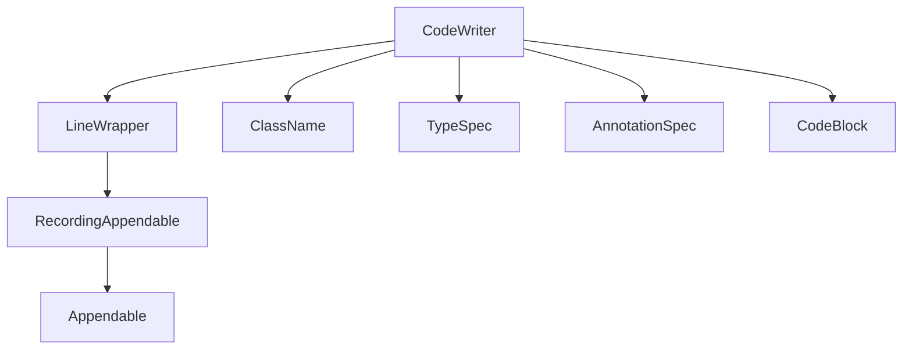

# Emission Engine & Formatting

The CodeWriter is the core emission component of the Javapoet library, responsible for converting an abstract syntax tree into source code that is both syntactically valid and stylistically consistent. It implements a **two-pass algorithm** where the first pass collects import information while traversing the AST, and the second pass emits the final output with resolved imports and proper formatting.

## Two-Pass Algorithm

CodeWriter operates in two distinct phases:

### First Pass — Collecting Imports

As CodeWriter emits code, it maintains several tracking structures to determine what must be imported:

- **`importableTypes`**: A `LinkedHashMap` mapping simple names (e.g., `"Entry"`) to their full `ClassName`. Entries are inserted when a type is encountered that cannot be resolved through existing imports, the current nesting context, or the same-package scope. On name collisions, the first inserted mapping wins.
- **`referencedNames`**: A `LinkedHashSet` of top-level simple names from classes in the current package. These are excluded from the final import suggestions since no import statement is needed for them.
- **`importedTypes`**: The set of types already available through import statements, used during name resolution to avoid premature collection.

After the first pass, `suggestedImports()` produces a `LinkedHashMap` containing only types that need import statements: it copies `importableTypes` and removes any names present in `referencedNames`.

### Second Pass — Emitting with Resolved Imports

During emission, CodeWriter uses its collected data to:
- Resolve type names to their shortest available alias (considering imports, nesting context, and current scope).
- Generate import statements for types that couldn't be resolved.
- Ensure static import members are handled correctly when a deferred type is followed by a dot-separated member access.

The `lookupName(ClassName)` method implements the core resolution logic: it checks for top-level name masking by type variables, finds the shortest resolvable suffix from enclosing classes (respecting nested types like `Map.Entry`), validates against imported types, and falls back to fully-qualified names when necessary.

## Indent Management

Indentation is managed through a single mutable `indentLevel` counter that tracks nesting depth:

| Method | Effect |
|---|---|
| `indent(level)` | Increments the indentation level by *level* (default 1). Used for entering blocks like methods, classes, and declarations. |
| `unindent(level)` | Decrements the indentation level by *level*. Used for exiting blocks. Guards against going below zero. |

Indentation is emitted **lazily** through `emitAndIndent()`. Instead of writing whitespace immediately, CodeWriter buffers content and emits indentation only when a newline forces it. This avoids trailing whitespace on lines that would otherwise be wrapped. The `emitting` flag (`trailingNewline`) tracks whether a newline has been written since the last emission, so indentation is added before each subsequent line within a block.

## Control Flow Handling

CodeWriter must distinguish between:
1. **Normal code lines**: indented according to current nesting level.
2. **Multi-line statement continuations**: indented two additional levels after the first line of the statement (e.g., an `if` body or `return` chain).

This is tracked via the `statementLine` field:
- When CodeWriter emits a newline while `statementLine == 0`, it increments `indentLevel` by 2. This ensures continuation lines are double-indented relative to the statement's first line.
- For each subsequent newline within the same statement (`statementLine > 0`), `statementLine` is incremented but no additional indentation change occurs.
- When `statementLine == -1`, normal indentation rules apply.

The `$[` and `$]` format tokens explicitly mark the start and end of multi-line statements, allowing CodeWriter to enforce consistent formatting for constructs like annotations, method declarations with many parameters, or long expressions.

## Line Wrapping ($W) and Zero-Width Newline ($Z)

Line wrapping is delegated to `LineWrapper`, which implements soft-wrapping on a column limit. The key format tokens are:

### $W — Wrapping Space

When CodeWriter encounters the `$W` token, it calls `out.wrappingSpace(indentLevel + 2)`. This emits a deferred wrapping space that will be resolved by `LineWrapper.flush()`:
- If the current line would exceed the column limit when the next character is appended, `flush(WRAP)` writes a newline followed by `(indentLevel + 2) × indent` characters.
- Otherwise, if no wrap is needed, the deferred space becomes a literal space character (`flush(SPACE)`).

The extra two-level indentation accounts for statement-line continuation formatting when wrapping occurs mid-statement.

### $Z — Zero-Width Newline

When CodeWriter encounters the `$Z` token, it calls `out.zeroWidthSpace(indentLevel + 2)`. This emits a deferred zero-width space that:
- Is emitted as nothing if there is no text on the current line (`column == 0`).
- Otherwise defers resolution similarly to `$W`, but with `flush(EMPTY)` which writes neither a newline nor a space.

Zero-width newlines are used to force line breaks for readability when the logical content doesn't naturally span multiple lines, such as in method signatures or long expressions. The indentation level passed ensures that any subsequent continuation of the wrapped statement maintains correct alignment.

## Relationship Between Components

- `CodeWriter` orchestrates the two-pass algorithm: first pass collects import candidates, second pass emits with resolved types.
- `LineWrapper` sits between `CodeWriter` and the final output, handling soft-wrapping, indentation emission, and format token resolution ($W, $Z).
- All formatting tokens are emitted through `emitAndIndent()`, which ensures lazy whitespace handling and statement-aware continuation indentation.

## Configuration & Options

| Option | Description | Default |
|---|---|---|
| **indent** | Whitespace string used for indentation (e.g., `"  "` or `"\t"`) | `"  "` |
| **columnLimit** | Maximum line length before wrapping occurs | 100 characters |
| **javadoc** | Whether we're emitting Javadoc documentation | `false` |
| **comment** | Whether we're emitting single-line comments | `false` |
| **staticImports** | Set of statically imported class names to use for member resolution | empty set |
| **alwaysQualify** | Types that must always be fully qualified, never shortened | empty set |

The `javadoc` flag changes comment prefix formatting: Javadoc uses `" * "` instead of `"// "`, and blank lines within Javadoc blocks are properly indented.

## Failure Modes & Invariants

- **Invalid indentation**: Attempting to unindent more levels than were previously entered throws an `IllegalArgumentException`.
- **Double package declaration**: Setting a package after one has already been declared throws via state check.
- **Mismatched statement tokens**: A `$]` without a matching `$[` (or vice versa) causes validation failures.
- **Deferred type collisions**: Static import resolution fails when the referenced member cannot be satisfied by an existing static import, requiring the caller to provide appropriate imports.
- **Closed LineWrapper**: Writing to a `LineWrapper` after calling `close()` throws immediately.

## Key Invariants

1. The two-pass algorithm is **not** truly sequential in execution; both passes interleave during a single traversal. Import collection (`importableTypes`) and name resolution happen simultaneously, but suggested imports are only computed after the full traversal completes via `suggestedImports()`.
2. Indentation state (`indentLevel`, `statementLine`, `trailingNewline`) is always consistent at line boundaries.
3. Name resolution is **deterministic** given a fixed set of imports and nesting context, ensuring reproducible output across runs.
4. The `LinkedHashMap` ordering in `importableTypes` preserves insertion order, which influences import statement ordering in the final suggestion.

## Tests That Matter

- Import suggestion accuracy: Verify that types correctly identified as needing imports are suggested, and types resolvable through context/imports are excluded.
- Indentation correctness: Test that blocks have proper indentation, multi-line statements use double-indentation for continuations, and no trailing whitespace is emitted.
- Line wrapping: Confirm that `$W` and `$Z` produce expected wrap behavior at the column limit, including handling of statement continuations across wraps.
- Name resolution: Ensure `lookupName()` correctly resolves types through imports, nesting context, and same-package scope, falling back to fully-qualified names when necessary.
- Static import interaction: Verify deferred type resolution with `$.` members produces correct static import usage or falls back to explicit qualification.

---

## Source References

- [CodeWriter.java](repo://src/main/java/com/squareup/javapoet/CodeWriter.java) — Main emission class implementing the two-pass algorithm, indentation management, and format token handling.
- [LineWrapper.java](repo://src/main/java/com/squareup/javapoet/LineWrapper.java) — Soft-wrapping implementation for line wrapping ($W), zero-width newlines ($Z), and indentation emission.
- [CodeWriterTest.java](repo://src/test/java/com/squareup/javapoet/CodeWriterTest.java) — Unit tests validating import suggestions, indentation formatting, and control flow handling.
